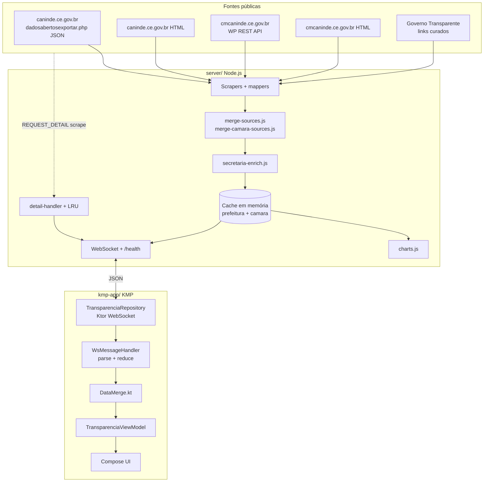
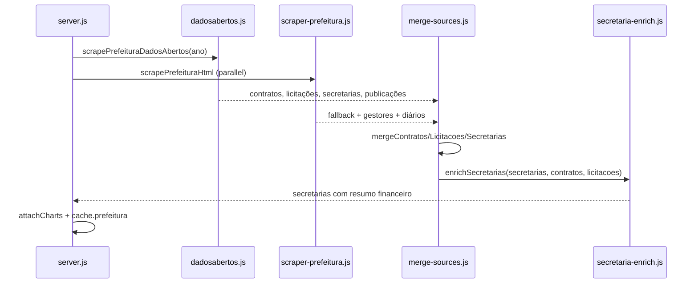
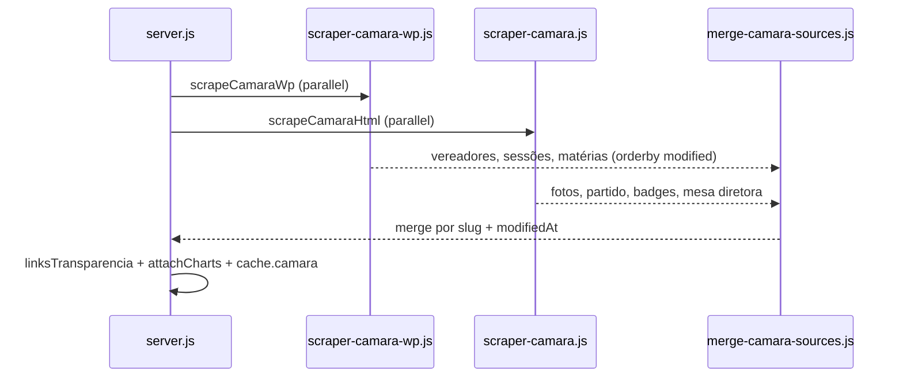
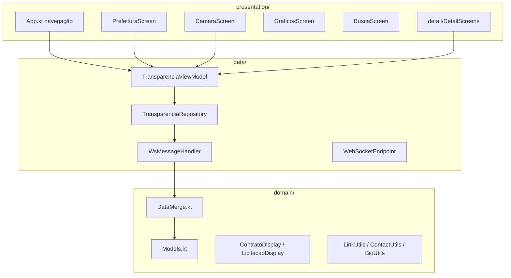

# Transparência Canindé

Aplicativo **Kotlin Multiplatform** (Compose Multiplatform) + **servidor Node.js** para consultar dados públicos da **Prefeitura** e da **Câmara Municipal de Canindé**, CE, em tempo quase real via **WebSocket**.

**Versão Android atual:** `1.1.0` (versionCode 2) · pacote `br.gov.caninde.transparencia`

| Documento | Conteúdo |
|-----------|----------|
| [`API.md`](API.md) | Contrato completo das mensagens WebSocket |
| [`docs/ROADMAP-DADOS.md`](docs/ROADMAP-DADOS.md) | Roadmap de fontes e fases futuras |
| [`docs/HOSPEDAGEM-GRATUITA.md`](docs/HOSPEDAGEM-GRATUITA.md) | Deploy no Render / Fly.io |
| [`server/TEST.md`](server/TEST.md) | Testes manuais do WebSocket |
| [`kmp-app/BUILD_VARIANTS.md`](kmp-app/BUILD_VARIANTS.md) | Flavors `dev` / `staging` / `prod` |

---

## Visão geral

O projeto separa **coleta de dados** (servidor) de **apresentação** (app). O servidor faz scraping periódico dos portais oficiais, normaliza os dados em JSON e distribui via WebSocket. O app mantém estado local, mescla atualizações e exibe listas, detalhes, gráficos e busca.

### Princípios

- **Não inventar dados** — só exibir o que veio das fontes ou erro/lista vazia com aviso no payload.
- **Preferir JSON/REST oficial** a parse HTML frágil.
- **Merge inteligente** — quando JSON e HTML coexistem, o registro mais completo e recente prevalece.
- **Detalhe sob demanda** — biografias, páginas longas e HTML pesado são buscados apenas quando o usuário abre o item.
- **Links externos** — portais financeiros (Governo Transparente) abrem no navegador; o app não simula dados que não possui.

### O que o app oferece hoje

| Área | Funcionalidades |
|------|-----------------|
| **Prefeitura** | Contratos, licitações, publicações/diário, secretarias enriquecidas, gestores, links GT |
| **Secretarias** | Secretário(a) atual, contratos/licitações/projetos em andamento e total em contratos por secretaria |
| **Câmara** | Vereadores, sessões, matérias, mesa diretora, produção legislativa, links GT |
| **Gráficos** | Agregações calculadas no servidor (licitações, contratos, matérias, etc.) |
| **Busca** | Filtro local sobre listas em cache |
| **Detalhes** | Vereador, matéria, secretaria, contrato, licitação, sessão, gestores, institucional + PDFs/links |

Município correto: **Canindé, CE** (IBGE **2302800**). Não confundir com Canindé de São Francisco (SE).

---

## Stack tecnológica

| Camada | Tecnologia |
|--------|------------|
| App UI | Kotlin Multiplatform, Compose Multiplatform, Material 3 |
| App rede | Ktor Client (WebSocket), Kotlinx Serialization |
| App DI | Koin |
| App arquitetura | Repository + ViewModel + `StateFlow` + `WsMessageHandler` (reducer puro) |
| Servidor | Node.js 18+, Express-like HTTP mínimo + `ws`, Axios, Cheerio |
| Deploy | Docker, Render (`render.yaml`), health em `/health` |
| Testes servidor | Node.js built-in test runner (47 testes) |
| Testes app | Kotlin common tests (`WsMessageHandler`, domain utils) |

---

## Arquitetura end-to-end



### Fluxo de dados (resumo)

1. **Servidor** faz scrape HTTP a cada 60 s (Prefeitura) e 90 s (Câmara).
2. Dados normalizados ficam em **cache em memória**.
3. Clientes WebSocket recebem `PREFEITURA_DATA` / `CAMARA_DATA` na conexão e após cada ciclo (broadcast).
4. **App** parseia JSON, mescla com estado anterior (`DataMerge`) e atualiza `StateFlow`s.
5. Toque em item → `REQUEST_DETAIL` → scrape pontual ou item do cache → `DETAIL_DATA`.

---

## Arquitetura do servidor (`server/`)

### Responsabilidades

| # | Função |
|---|--------|
| 1 | Coleta HTTP (Axios + Cheerio) com prioridade JSON na Prefeitura |
| 2 | Merge paralelo JSON + HTML; enriquecimento de secretarias |
| 3 | Cache em memória e broadcast WebSocket |
| 4 | Detalhe sob demanda (`REQUEST_DETAIL`) com cache LRU |
| 5 | Rate limit por IP e token WS opcional |
| 6 | Health check HTTP (`GET /health`) para hospedagem |

### Ciclo de vida

| Etapa | Comportamento |
|-------|----------------|
| Startup | `initAndSchedule()` — scrape inicial paralelo Prefeitura + Câmara |
| Periódico | Prefeitura **60 s**; Câmara **90 s** (`lib/config.js`) |
| Nova conexão WS | Envia cache atual + `SERVER_STATUS` |
| `REQUEST_*` | Retorna cache ou força scrape (`REQUEST_REFRESH`) |
| `REQUEST_DETAIL` | `detail-handler` → HTML ou item já listado no cache |

### Módulos (`server/lib/`)

| Módulo | Função |
|--------|--------|
| `server.js` | Orquestração, intervalos, WebSocket, broadcast, `/health` |
| `config.js` | Porta, intervalos, TLS, `WS_AUTH_TOKEN`, rate limit |
| `ws-handler.js` | Parse e roteamento de mensagens WS |
| `scrape-result.js` | Payloads `PREFEITURA_DATA` / `CAMARA_DATA`, erros parciais |
| **Prefeitura** | |
| `scraper-prefeitura-dadosabertos.js` | JSON oficial (`fetchDataset`, mappers) |
| `scraper-prefeitura.js` | Fallback HTML: contratos, licitações, diários, secretarias |
| `merge-sources.js` | Merge JSON+HTML; gestores; publicações; **enriquece secretarias** |
| `secretaria-enrich.js` | Vincula contratos/licitações/projetos por secretaria |
| `contrato-html.js` | Parser HTML de contratos (secretaria/objeto/valor colados) |
| `licitacao-html.js` | Filtro de licitações (exclui comissão permanente) |
| `gestor-html.js` | Prefeito e vice a partir de `gestores.php` |
| **Câmara** | |
| `scraper-camara-wp.js` | WP REST API (`/wp-json/wp/v2/vereadores`, `sessao`, `materia`) |
| `scraper-camara.js` | HTML: cards `.cardlist`, badges matérias/sessões |
| `merge-camara-sources.js` | Merge WP + HTML (preferência por `modifiedAt`) |
| `scraper-camara-transparencia.js` | Links Governo Transparente / portal (sem folha pessoal) |
| **Detalhe e utilitários** | |
| `scraper-detail-prefeitura.js` | Secretaria, gestores, institucional |
| `scraper-detail-camara.js` | Vereador (mandato, sessões presentes), matéria, institucional |
| `detail-handler.js` | Roteamento `REQUEST_DETAIL` por entidade |
| `detail-cache.js` | LRU de respostas de detalhe |
| `charts.js` | Séries para campo `graficos` |
| `rate-limit.js` | Limite de mensagens por IP |

### Fluxo Prefeitura (`scrapePrefeitura`)



**Notas importantes:**

- Dataset `secretarias` **não usa** parâmetro `a=` (ano); os demais datasets usam exercício corrente.
- Secretarias recebem gestor (`Gestor`), contato, endereço e listas derivadas de contratos/licitações.
- Licitações sem campo `Secretaria` são associadas por texto do `Objeto`.

### Fluxo Câmara (`scrapeCamara`)



### Mensagens WebSocket (resumo)

| Cliente → servidor | Servidor → cliente |
|--------------------|-------------------|
| `REQUEST_PREFEITURA` | `PREFEITURA_DATA` |
| `REQUEST_CAMARA` | `CAMARA_DATA` |
| `REQUEST_REFRESH` | `REFRESHING` + dados atualizados |
| `REQUEST_DETAIL` | `DETAIL_DATA` |
| `PING` | `PONG` |

Contrato completo, campos e exemplos: [`API.md`](API.md).

### Testes

```bash
cd server && npm test
```

Cobertura: dados abertos, merge, secretarias, Câmara WP, WS handler, parsers HTML, gráficos.

---

## Arquitetura do app (`kmp-app/`)

### Estrutura de módulos

```
kmp-app/
├── androidApp/          # Entry Android, BuildConfig, flavors, assinatura release
└── shared/
    └── src/
        ├── commonMain/  # Domain, data, UI Compose (compartilhável)
        ├── androidMain/ # HttpClient, ExternalLinks (actual)
        ├── iosMain/     # Stubs iOS (preparado para target futuro)
        └── commonTest/  # Testes unitários compartilhados
```

### Camadas (`shared/src/commonMain/kotlin/br/gov/caninde/transparencia/`)



| Camada | Arquivos principais | Papel |
|--------|---------------------|-------|
| **domain** | `Models.kt`, `DataMerge.kt` | Entidades `@Serializable`, merge client-side, formatação de exibição |
| **data** | `TransparenciaRepository.kt`, `WsMessageHandler.kt`, `TransparenciaViewModel.kt` | WebSocket, reducer de mensagens, exposição via `StateFlow` |
| **presentation** | `App.kt`, `*Screen.kt`, `Components.kt`, `Theme.kt` | Compose UI, navegação, componentes reutilizáveis |
| **presentation/detail** | `DetailScreens.kt` | Telas de detalhe + links PDF/portal |
| **platform** | `ExternalLinks.kt` (expect/actual) | Abrir URL no navegador / visualizador PDF |

### Fluxo de dados no cliente

1. `MainActivity` injeta `WebSocketEndpoint` (host/porta/esquema do flavor) via Koin.
2. `TransparenciaRepository.connect()` abre WebSocket e envia `REQUEST_PREFEITURA` + `REQUEST_CAMARA`.
3. `PING` a cada 30 s; reconexão automática (até 10 tentativas).
4. Cada frame JSON → `WsMessageHandler.reduce()` → `DataMerge` preserva dados mais recentes/completos.
5. `TransparenciaViewModel` expõe `prefeituraState`, `camaraState`, `detailState`, `connectionState`.
6. Detalhe: cache local por `entity+id`; miss → `REQUEST_DETAIL` → `DETAIL_DATA`.

### Navegação

**Abas principais** (`NavigationBar`): Prefeitura · Câmara · Gráficos · Busca.

**Rotas de detalhe** (`AppRoute`):

| Rota | Entidade WS | Origem dos dados |
|------|-------------|------------------|
| `Vereador(slug)` | `vereador` | Scrape perfil + merge listagem |
| `Materia(slug)` | `materia` | Scrape página da matéria |
| `Secretaria(id)` | `secretaria` | Cache enriquecido + scrape contato |
| `Contrato(numero)` | `contrato` | Item da listagem em cache |
| `Licitacao(numero)` | `licitacao` | Item da listagem em cache |
| `Sessao(id)` | `sessao` | Item da listagem (índice ou slug) |
| `Gestores` | `gestores` | Scrape `gestores.php` |
| `Institucional` | `institucional` | Scrape página institucional |

### Telas principais

| Tela | Abas / modos | Destaques |
|------|--------------|-----------|
| **Prefeitura** | Contratos, Licitações, Publicações, Secretarias, Transparência | Cards resumo; gestores; links GT |
| **Câmara** | Legislativo: Parlamentares, Sessões, Matérias, Mesa · Transparência: links | Badges matérias/sessões; legislatura; detalhe vereador |
| **Gráficos** | Prefeitura + Câmara | Barras a partir de `graficos` no payload |
| **Busca** | — | Filtro local em contratos, licitações, secretarias, vereadores, matérias |

### Modelos de domínio (principais)

| Modelo | Campos relevantes |
|--------|-------------------|
| `Contrato` | numero, objeto, valor, empresa, secretaria, pdfUrl, cnpjCredor |
| `Licitacao` | numero, modalidade, objeto, situacao, dataAbertura, url |
| `Secretaria` | secretario, cargoGestor, contato, resumoFinanceiro, contratos[], licitacoes[], projetosAndamento[] |
| `Parlamentar` | nome, partido, cargo, vinculo, legislatura, totalMaterias/Sessoes, sessoesPresentes[] |
| `Sessao` / `Materia` | titulo, data, slug, url, modifiedAt |
| `GraficosPayload` | Listas `ChartSeries` (titulo, labels, valores) |

Utilitários: `ContratoDisplay.kt` e `LicitacaoDisplay.kt` normalizam títulos/descrições para UI; `ContactUtils.kt` trata WhatsApp clicável.

---

## Fontes de dados utilizadas

### Prefeitura Municipal

| Fonte | URL / endpoint | Uso |
|-------|----------------|-----|
| **Dados abertos JSON** (prioritário) | `dadosabertosexportar.php?d={dataset}&f=json` | Contratos, licitações, secretarias, publicações |
| Portal HTML | caninde.ce.gov.br | Fallback + gestores + parsers especializados |
| Detalhe secretaria | `secretaria.php?sec={id}` | Contato complementar |
| Governo Transparente | ID **11979490** | Links na aba Transparência |

**Datasets JSON:**

| `d=` | Conteúdo mapeado |
|------|------------------|
| `contratos` | Valor, credor, CNPJ, secretaria, PDF, vigência |
| `licitacoes` | Processo, objeto, modalidade, abertura, URL |
| `secretarias` | Nome, gestor, e-mail, telefone, endereço, horário |
| `publicacoes` | Diários e publicações oficiais |

**Enriquecimento de secretarias:** após merge, `secretaria-enrich.js` agrega contratos (campo `Secretaria`), licitações (match por texto no `Objeto`) e calcula projetos em andamento + total em contratos.

### Câmara Municipal

| Fonte | URL | Uso |
|-------|-----|-----|
| **WP REST API** (prioritário) | `/wp-json/wp/v2/vereadores`, `sessao`, `materia` | Listas ordenadas por `modified` |
| HTML portal | `/parlamentares/`, `/sessoes/`, `/materias/` | Fotos, partido, badges, mesa diretora |
| Detalhe vereador | `/vereadores/{slug}/` | Mandato, naturalidade, sessões presentes |
| Detalhe matéria | `/materia/{slug}/` | Texto, PDF |
| Governo Transparente | ID **11979588** | Links financeiros (sem folha pessoal) |

### Referências planejadas

Documentadas em [`docs/ROADMAP-DADOS.md`](docs/ROADMAP-DADOS.md): integração API Governo Transparente, TCE-CE, Portal da Transparência federal, busca unificada no servidor.

---

## Estrutura do repositório

```
transparencia-caninde/
├── server/                 # Servidor WebSocket + scrapers
├── kmp-app/                # App Kotlin Multiplatform
│   ├── androidApp/
│   └── shared/
├── docs/                   # Roadmap, hospedagem
├── releases/android/       # Artefatos de release locais (AAB/APK)
├── store-assets/           # Materiais divulgação (Instagram, etc.)
├── API.md                  # Contrato WebSocket
├── render.yaml             # Deploy Render
└── docker-compose.yml
```

---

## Pré-requisitos

- **Servidor:** Node.js 18+
- **Android:** JDK 17, Android SDK 24+ (Android Studio recomendado)

## Servidor WebSocket

```bash
cd server
npm install
npm start
# desenvolvimento com reload:
npm run dev
```

- Local: `ws://localhost:8080`
- Emulador Android: `ws://10.0.2.2:8080`
- Produção (Render): `wss://transparencia-caninde.onrender.com`
- Health: `GET /health`

### Variáveis de ambiente

| Variável | Descrição |
|----------|-----------|
| `PORT` | Porta (padrão `8080`) |
| `NODE_ENV` | `production` — valida certificados TLS no scraping |
| `WS_AUTH_TOKEN` | Exige `?token=` na conexão WS ([`.env.example`](server/.env.example)) |
| `RATE_LIMIT_MAX` | Máximo de mensagens por IP por janela |
| `RATE_LIMIT_WINDOW_MS` | Janela do rate limit (padrão 60000) |

### Docker

```bash
docker compose up
```

### Hospedagem gratuita

Deploy no **Render** via [`render.yaml`](render.yaml). Guia: [`docs/HOSPEDAGEM-GRATUITA.md`](docs/HOSPEDAGEM-GRATUITA.md).

---

## App Android

| Flavor | WebSocket | Pacote | Uso |
|--------|-----------|--------|-----|
| **dev** | `ws://10.0.2.2:8080` | `…transparencia.dev` | Emulador + servidor local |
| **staging** | `wss://transparencia-caninde.onrender.com` | `…transparencia.staging` | Testes em dispositivo |
| **prod** | `wss://transparencia-caninde.onrender.com` | `br.gov.caninde.transparencia` | Play Store |

```bash
cd kmp-app

# Desenvolvimento
./gradlew :androidApp:installDevDebug

# Staging (celular → Render)
./gradlew :androidApp:installStagingDebug

# Release Play Store
./gradlew :androidApp:bundleProdRelease
# Saída: androidApp/build/outputs/bundle/prodRelease/androidApp-prod-release.aab
```

Artefatos copiados em `releases/android/v1.1.0/`. Assinatura release: `kmp-app/keystore.properties` + `release.jks` (gitignored). Ver [`keystore.properties.example`](kmp-app/keystore.properties.example).

**Ordem:** subir o servidor (ou usar Render) antes de abrir o app.

---

## Repositório

```bash
git clone https://github.com/jordilucas/transparencia_caninde.git
cd transparencia_caninde
```

---

## Licença

Projeto de transparência pública municipal. Uso conforme legislação de acesso à informação e termos dos portais de origem.
