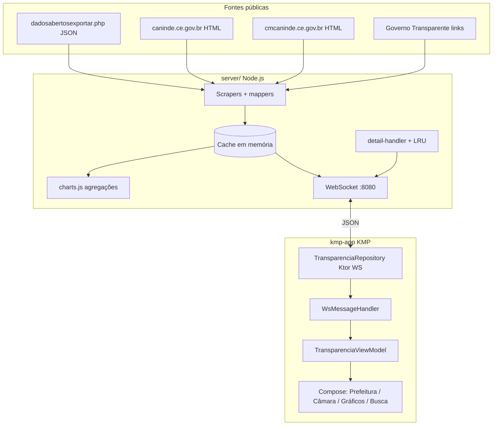

# Transparência Canindé

Aplicativo **Kotlin Multiplatform** (Compose) + **servidor Node.js** para consultar dados públicos da **Prefeitura** e da **Câmara Municipal de Canindé**, CE, em tempo quase real via WebSocket.

O app **não inventa dados**: exibe apenas o que foi obtido dos portais oficiais (ou links curados para portais externos). Se a coleta falhar, mostra mensagem de erro ou listas vazias com aviso no payload.

**Recursos:** listas com detalhe sob demanda (vereador, matéria, secretaria, contrato, licitação, sessão, gestores), gráficos agregados no servidor, abas de transparência com links para Governo Transparente, publicações oficiais (JSON) e PDFs/links clicáveis nas telas de detalhe.

| Documento | Conteúdo |
|-----------|----------|
| [`API.md`](API.md) | Contrato completo das mensagens WebSocket |
| [`docs/ROADMAP-DADOS.md`](docs/ROADMAP-DADOS.md) | Roadmap de fontes e fases futuras (federal, TCE, busca, etc.) |
| [`server/TEST.md`](server/TEST.md) | Como testar o WS manualmente |
| [`kmp-app/BUILD_VARIANTS.md`](kmp-app/BUILD_VARIANTS.md) | Variantes `dev` / `staging` / `prod` do app |

---

## Fontes de dados utilizadas

Município correto: **Canindé, CE** (IBGE **2302800**). Não confundir com Canindé de São Francisco (SE).

### Prefeitura Municipal

| Fonte | URL / endpoint | Uso no sistema |
|-------|----------------|----------------|
| Portal principal | https://www.caninde.ce.gov.br | Metadados, fallback HTML |
| Transparência | https://www.caninde.ce.gov.br/acessoainformacao.php | Institucional (detalhe) |
| **Dados abertos JSON** (prioritário) | `https://www.caninde.ce.gov.br/dadosabertosexportar.php?d={dataset}&a={ano}&f=json` | Contratos, licitações, secretarias, publicações |
| Contratos (HTML fallback) | https://www.caninde.ce.gov.br/contratos.php | Se JSON vier vazio |
| Licitações (HTML fallback) | https://www.caninde.ce.gov.br/licitacao.php | Se JSON vier vazio |
| Diário (HTML fallback) | https://www.caninde.ce.gov.br/diariolista.php | Se não houver `publicacoes` no JSON |
| Secretarias (HTML fallback) | Links `secretaria.php?sec=` na página de transparência | Se JSON vier vazio |
| Secretaria (detalhe) | `secretaria.php?sec={id}` | Scrape sob demanda (`REQUEST_DETAIL`) |
| Gestores | https://www.caninde.ce.gov.br/gestores.php | Prefeito/vice (detalhe) |
| Portal dados abertos | https://www.caninde.ce.gov.br/dadosabertos.php | Link na aba Transparência |

**Datasets JSON consumidos hoje** (`d=`):

| Dataset | Campos principais mapeados |
|---------|---------------------------|
| `contratos` | `NumeroContrato`, `Objeto`, `ValorGlobal`, `NomeCredor`, `CNPJCPF`, `Secretaria`, `DataContrato`, `Arquivo`, `Url` |
| `licitacoes` | `NumeroPrecesso`, `Objeto`, `Modalidade`, `DataAbertura`, `Situacao`, `Url` |
| `secretarias` | `Secretaria`, `Gestor`, `Email`, `Telefone1`, `HorarioFunciona` |
| `publicacoes` | `Descricao`, `TipoArquivo`, `Data`, `Url` |

Outros datasets listados no portal (`obras`, `diarias`, `pessoal`, `LRF`, etc.) estão documentados no roadmap para fases futuras.

### Câmara Municipal

| Fonte | URL | Uso no sistema |
|-------|-----|----------------|
| Portal | https://www.cmcaninde.ce.gov.br | Base de todos os scrapes legislativos |
| Vereadores + mesa | `/parlamentares/` | Lista, foto, cargo, partido, `slug` |
| Sessões | `/sessoes/` | Título, data, link de vídeo/sessão |
| Matérias | `/materias/` | Título, tipo, autor, PDF |
| Vereador (detalhe) | `/vereadores/{slug}/` | Biografia, contato, WhatsApp normalizado |
| Matéria (detalhe) | `/materia/{slug}/` | Texto, PDF, links |
| Canindé Transparente | https://www.cmcaninde.ce.gov.br/caninde-transparente/ | Hub de transparência da Câmara |
| Institucional (detalhe) | Página inicial da Câmara | Contato institucional |

### Governo Transparente (links curados, sem API ainda)

IDs oficiais usados apenas para montar URLs no app (abrem no navegador):

| Órgão | ID GT | Exemplos de destino |
|-------|-------|---------------------|
| Prefeitura | **11979490** | Receitas, despesas, convênios, obras, emendas |
| Câmara | **11979588** | Receitas, despesas, licitações/contratos, pessoal, LRF |

Base: `https://www.governotransparente.com.br/transparencia/...`

### Referências planejadas (não integradas)

Documentadas em [`docs/ROADMAP-DADOS.md`](docs/ROADMAP-DADOS.md): API Portal da Transparência (CGU), TCE-CE, TCU, busca unificada.

---

## Arquitetura geral



```
Portais oficiais (HTTP)
        ↓
  server/ — scrape periódico + cache + detalhe sob demanda
        ↓ WebSocket (JSON)
  kmp-app/shared — domain + data + presentation
        ↓
  androidApp — APK por flavor (dev/staging/prod)
```

---

## Arquitetura do servidor (`server/`)

### Responsabilidades

1. **Coleta HTTP** (Axios + Cheerio) dos portais, com prioridade JSON na Prefeitura.
2. **Cache em memória** (`cache.prefeitura`, `cache.camara`) atualizado em intervalos fixos.
3. **Broadcast** de `PREFEITURA_DATA` / `CAMARA_DATA` a todos os clientes após cada ciclo.
4. **Detalhe sob demanda** via `REQUEST_DETAIL` (scrape de página ou objeto já no cache).
5. **Rate limit** por IP e autenticação opcional por token na query string.

### Ciclo de vida

| Etapa | Comportamento |
|-------|----------------|
| Startup | `initAndSchedule()` — scrape inicial paralelo Prefeitura + Câmara |
| Periódico | Prefeitura a cada **60 s**; Câmara a cada **90 s** (`lib/config.js`) |
| Nova conexão WS | Envia cache atual + `SERVER_STATUS` |
| `REQUEST_*` | Retorna cache ou força novo scrape (`REQUEST_REFRESH`) |
| `REQUEST_DETAIL` | `detail-handler` → scrape HTML ou item da listagem (contrato/licitação) |

### Módulos (`server/lib/`)

| Módulo | Função |
|--------|--------|
| `server.js` | Orquestração, intervalos, WebSocket, broadcast |
| `config.js` | Porta, intervalos, TLS, `WS_AUTH_TOKEN`, rate limit |
| `ws-handler.js` | Parse e roteamento de mensagens WS |
| `scrape-result.js` | Monta payloads `PREFEITURA_DATA` / `CAMARA_DATA`, erros parciais |
| `scraper-prefeitura-dadosabertos.js` | **Fase 1:** JSON oficial (`fetchDataset`, mappers) |
| `scraper-prefeitura.js` | Fallback HTML: contratos, licitações, diários, secretarias |
| `scraper-camara.js` | Vereadores, sessões, matérias, mesa diretora |
| `scraper-camara-transparencia.js` | **Fase 2:** `linksTransparencia` (GT + portal) |
| `scraper-detail-prefeitura.js` | Detalhe secretaria, gestores, institucional |
| `scraper-detail-camara.js` | Detalhe vereador, matéria, institucional; WhatsApp |
| `detail-handler.js` | Roteamento `REQUEST_DETAIL` por entidade |
| `detail-cache.js` | LRU de respostas de detalhe |
| `charts.js` | Séries para `graficos` no payload |
| `rate-limit.js` | Limite de mensagens por IP |

### Fluxo Prefeitura (`scrapePrefeitura`)

1. Tenta `scrapePrefeituraDadosAbertos(http, anoCorrente)`.
2. Se contratos/licitações/secretarias vazios → fallback nas páginas HTML.
3. Diários: derivados de `publicacoes` ou scrape de `diariolista.php`.
4. Anexa `linksTransparencia` (Prefeitura) e `attachCharts`.
5. Persiste em `cache.prefeitura`.

### Fluxo Câmara (`scrapeCamara`)

1. GET `/parlamentares/`, `/sessoes/`, `/materias/`.
2. Parse HTML (layout WordPress `.cardlist`, vídeos em sessões).
3. Anexa `linksTransparencia` (Câmara), gráficos e cache.

### Mensagens WebSocket (resumo)

| Cliente → servidor | Servidor → cliente |
|--------------------|-------------------|
| `REQUEST_PREFEITURA` | `PREFEITURA_DATA` |
| `REQUEST_CAMARA` | `CAMARA_DATA` |
| `REQUEST_REFRESH` | `REFRESHING` + dados atualizados |
| `REQUEST_DETAIL` | `DETAIL_DATA` |
| `PING` | `PONG` |

Payloads, campos opcionais (`publicacoes`, `linksTransparencia`, `pdfUrl`, etc.) e exemplos: [`API.md`](API.md).

### Testes

```bash
cd server && npm test
```

Inclui mapeamento JSON (`test/dadosabertos.test.js`), scrapers, `ws-handler`, gráficos.

---

## Arquitetura do app (`kmp-app/`)

### Módulos Gradle

| Módulo | Papel |
|--------|-------|
| `:shared` | Lógica comum: domain, WebSocket, ViewModel, UI Compose |
| `:androidApp` | Entry point Android, `BuildConfig` (URL do WS por flavor) |

### Camadas (`shared/src/commonMain/kotlin/...`)

```
domain/          Modelos @Serializable, DetailEntity, estados de UI
data/            TransparenciaRepository (Ktor WebSocket)
                 WsMessageHandler (parse + reduce estado)
                 TransparenciaViewModel, WebSocketEndpoint, AppModule
presentation/    App.kt (navegação), telas Prefeitura/Câmara/Gráficos/Busca
                 Components, Theme, TransparenciaLinks
presentation/detail/  DetailScreens, links PDF, contato WhatsApp
platform/        openExternalUrl (expect/actual Android/iOS)
```

### Fluxo de dados no cliente

1. `TransparenciaRepository.connect()` abre WebSocket (`WebSocketEndpoint.url`).
2. Envia `REQUEST_PREFEITURA` e `REQUEST_CAMARA`; mantém `PING` a cada 30 s.
3. Cada frame JSON passa por `WsMessageHandler.reduce()` → atualiza `StateFlow`s.
4. `TransparenciaViewModel` expõe estados para Compose.
5. Toque em item → `REQUEST_DETAIL` → `DETAIL_DATA` (com cache local por entidade+id).

### Navegação e telas

**Abas principais** (`NavigationBar`): Prefeitura · Câmara · Gráficos · Busca.

**Rotas de detalhe** (`AppRoute`): vereador, matéria, secretaria, contrato, licitação, sessão, gestores, institucional.

| Tela | Conteúdo principal |
|------|-------------------|
| `PrefeituraScreen` | Abas: Contratos, Licitações, Publicações, Secretarias, Transparência (links GT) |
| `CamaraScreen` | Modo **Legislativo** (vereadores, sessões, matérias, mesa) ou **Transparência** (links) |
| Gráficos | Séries `graficos` do payload WS |
| Busca | Filtro local sobre listas em cache |
| `DetailScreens` | Campos enriquecidos + PDF/link externo |

### Utilitários de domínio

- `LinkUtils.kt` — URLs absolutas e detecção de PDF.
- `ContactUtils.kt` — WhatsApp clicável (não URL de compartilhamento).
- `BioUtils.kt` — texto de biografia do vereador.

---

## Pré-requisitos

- **Servidor:** Node.js 18+
- **Android:** JDK 17, Android SDK 24+ (Android Studio recomendado)

## Servidor WebSocket

```bash
cd server
npm install
npm start
# desenvolvimento com reload:
npm run dev
```

Servidor em `ws://localhost:8080` (emulador Android: `ws://10.0.2.2:8080`).

Se a porta estiver em uso:

```bash
lsof -i :8080 -sTCP:LISTEN
kill <PID>
npm start
```

### Variáveis de ambiente

| Variável | Descrição |
|----------|-----------|
| `PORT` | Porta (padrão `8080`) |
| `NODE_ENV` | `production` — valida certificados TLS no scraping |
| `WS_AUTH_TOKEN` | Exige `?token=` na conexão WebSocket ([`.env.example`](server/.env.example)) |
| `RATE_LIMIT_MAX` | Máximo de mensagens por IP por janela |
| `RATE_LIMIT_WINDOW_MS` | Janela do rate limit (padrão 60000) |

### Docker

```bash
docker compose up
```

Sobe o servidor na porta **8080** ([`docker-compose.yml`](docker-compose.yml)).

## App Android

```bash
cd kmp-app
./gradlew :androidApp:installDevDebug
```

Variantes `dev`, `staging`, `prod` definem host/porta/esquema do WebSocket via `BuildConfig`.

**Ordem de execução:** subir o servidor antes de abrir o app.

---

## Repositório

```bash
git clone https://github.com/jordilucas/transparencia_caninde.git
cd transparencia_caninde
```

## Licença

Projeto de transparência pública municipal. Uso conforme legislação de acesso à informação e termos dos portais de origem.
