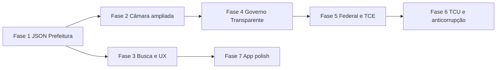

# Roadmap de dados — Transparência Canindé

Documento de continuidade para enriquecer o **servidor Node** (scraping/API) e o **app KMP**, com fontes públicas reais. Atualizado com base na análise de scraping e portais externos (jun/2026).

**Princípios (não negociáveis):**

- Não inventar dados: só exibir o que foi obtido das fontes ou erro/lista vazia.
- Preferir **JSON/REST oficial** a parse HTML frágil.
- Dados pessoais (folha nominal, CPF): agregar, link externo ou omitir — ver LGPD na Fase 4.
- Manter contrato WebSocket documentado em [`API.md`](../API.md).

---

## Estado atual (baseline)

### Servidor (`server/`)

| Módulo | Função |
|--------|--------|
| `server.js` | Ciclo periódico: scrape prefeitura + câmara; WebSocket |
| `lib/scraper-prefeitura.js` | Fallback HTML: contratos, licitações, diários, secretarias |
| `lib/scraper-prefeitura-dadosabertos.js` | JSON `dadosabertosexportar.php` (Fase 1) |
| `lib/scraper-camara-transparencia.js` | Links Governo Transparente / portal (Fase 2) |
| `lib/scraper-camara.js` | Cards: vereadores, sessões, matérias, mesa |
| `lib/scraper-detail-*.js` | `REQUEST_DETAIL` sob demanda + cache LRU |
| `lib/charts.js` | Agregações para `graficos` no payload |
| `lib/detail-handler.js` | Roteamento de entidades de detalhe |

### App (`kmp-app/shared/`)

- Listas + detalhe (`REQUEST_DETAIL` / `DETAIL_DATA`)
- Busca local nas listas em cache (sem servidor de busca)
- Gráficos a partir de `graficos` no payload WS

### Lacunas principais

1. **Prefeitura:** ignora `dadosabertosexportar.php?f=json` (dados muito mais ricos).
2. **Governo Transparente** (IDs abaixo): citado no código, **não integrado**.
3. **Câmara:** só legislativo; financeiro/transparência em [caninde-transparente](https://www.cmcaninde.ce.gov.br/caninde-transparente/) fora do app.
4. **Federal/estadual:** sem emendas/transferências (IBGE **2302800**).

---

## Referências rápidas

| Recurso | Identificador / URL |
|---------|---------------------|
| Município IBGE | **2302800** (Canindé, CE) |
| Governo Transparente — Prefeitura | **11979490** — [transparência](https://www.governotransparente.com.br/transparencia/receitas/11979490) |
| Governo Transparente — Câmara | **11979588** — [ecossistema câmara](https://www.cmcaninde.ce.gov.br/caninde-transparente/) |
| Portal Prefeitura | https://www.caninde.ce.gov.br |
| Portal Câmara | https://www.cmcaninde.ce.gov.br |
| Dados abertos JSON (Prefeitura) | `https://www.caninde.ce.gov.br/dadosabertosexportar.php?d={dataset}&a={ano?}&f=json` |
| API Portal Transparência federal | https://api.portaldatransparencia.gov.br/ (token Gov.br) |
| API TCE-CE | https://api.tce.ce.gov.br/ (`codigo_municipio` a confirmar na doc TCE) |
| TCU webservices | https://sites.tcu.gov.br/dados-abertos/webservices-tcu/ |

### Datasets JSON confirmados (`dadosabertosexportar.php`)

Parâmetro `d` (testar `a=` para exercício quando retornar “sem registros”):

| `d` | Status testado | Campos úteis (exemplos) |
|-----|----------------|-------------------------|
| `licitacoes` | OK | `NumeroPrecesso`, `Objeto`, `Modalidade`, `DataAbertura`, `Url` |
| `contratos` | OK | `ValorGlobal`, `NomeCredor`, `CNPJCPF`, vigência, `Secretaria`, `Arquivo`, `Url` |
| `secretarias` | OK | `Gestor`, `Email`, `Telefone1`, `HorarioFunciona` |
| `publicacoes` | OK | `Descricao`, `TipoArquivo`, `Url` |
| `decretos`, `leis`, `conselhos`, `concursopublico`, `LRF` | Export CSV/JSON listado no portal | A validar schema |
| `obras`, `diarias`, `pessoal` | Requer `a=` (ano) | A descobrir na Fase 1 |

---

## Visão das fases



| Fase | Nome | Esforço | Impacto no app |
|------|------|---------|----------------|
| **1** | Dados abertos JSON (Prefeitura) | Médio | Alto |
| **2** | Câmara: legislativo + transparência | Médio | Alto |
| **3** | Busca e índice local | Baixo–médio | Médio |
| **4** | Governo Transparente (links ou API) | Alto | Muito alto (financeiro) |
| **5** | Federal (CGU) + TCE-CE | Médio | Complementar |
| **6** | TCU / sanções | Baixo–médio | Complementar |
| **7** | Consolidar docs, testes, observabilidade | Baixo | Manutenção |

Cada fase pode virar **PR separado**; ver skill `split-to-prs` se necessário.

---

## Fase 1 — Prefeitura via JSON oficial

**Objetivo:** Substituir ou complementar o scrape HTML com `dadosabertosexportar.php`, enriquecendo modelos e detalhes (PDF, valores, contatos de secretarias).

### Entregas

1. **Novo módulo** `server/lib/scraper-prefeitura-dadosabertos.js`
   - Funções: `fetchDataset(d, ano?)`, `mapContratos`, `mapLicitacoes`, `mapSecretarias`, opcional `mapPublicacoes`, `mapLRF`.
   - Tratamento de erro quando resposta for HTML/alert JS (“sem registros”).
   - Descobrir e documentar parâmetro **`a`** (exercício) para `obras`, `diarias`, `pessoal`.

2. **Integração em** `server.js`
   - `scrapePrefeitura()` chama JSON primeiro; fallback HTML se JSON falhar.
   - Mesclar: se JSON trouxer mais campos, preferir JSON; contagem em `resumo`.

3. **Modelos (Kotlin + payload WS)**
   - Estender em `Models.kt` / payloads:
     - `Contrato`: `valorNumerico?`, `cnpjCredor?`, `secretaria?`, `pdfUrl?`, `vigenciaInicio/Fim?`
     - `Licitacao`: `dataAbertura?`, `processo?`, `urlDetalhe?`
     - `Secretaria`: já tem `contato` — preencher do JSON (`Email`, `Telefone1`, `HorarioFunciona`)
     - Novos tipos opcionais: `Publicacao`, `Obra`, `Diaria` (se Fase 1b)

4. **Detalhe**
   - `REQUEST_DETAIL` contrato/licitação: usar objeto completo do cache JSON (não só linha da tabela HTML).
   - PDF: campo `Arquivo` / `Url` → `DetailLinkAction` (já existe no app).

5. **Testes**
   - Fixtures JSON em `server/test/fixtures/dadosabertos-*.json`
   - Testes de mapeamento sem rede; 1 teste de integração opcional (marca `skip` em CI).

6. **Docs**
   - Atualizar [`API.md`](../API.md) com novos campos opcionais.
   - Registrar URLs de fonte em `payload.fonte` / `payload.sources`.

### Critérios de aceite

- [x] Contratos exibem valor e link/PDF quando existirem no JSON.
- [x] Secretarias na lista mostram gestor/e-mail quando o JSON trouxer.
- [x] Licitações com `Url` abrem detalhe ou link externo coerente.
- [x] `npm test` e testes Kotlin de parse passam.
- [x] Sem dados fictícios em fallback.

### Arquivos previstos

```
server/lib/scraper-prefeitura-dadosabertos.js   (novo)
server/lib/scraper-prefeitura.js                (refatorar ou delegar)
server/test/dadosabertos.test.js                (novo)
kmp-app/.../domain/Models.kt
kmp-app/.../data/WsMessageHandler.kt
kmp-app/.../presentation/PrefeituraScreen.kt
docs/ROADMAP-DADOS.md                           (este arquivo — marcar checklist)
```

### Riscos

| Risco | Mitigação |
|-------|-----------|
| API `dadosabertosexportar` mudar | Fixtures + fallback HTML |
| Parâmetro `a` obrigatório | Default ano corrente; log quando vazio |
| PDF em path relativo | `resolveAbsoluteUrl` (já em `LinkUtils.kt`) |

---

## Fase 1b — Obras, diárias, pessoal (Prefeitura)

**Objetivo:** Após descobrir `a=` (exercício), expor novas listas no WS e abas do app.

### Entregas

- Payload `PREFEITURA_DATA`: `obras[]`, `diarias[]`, resumo folha **agregado** (totais por secretaria, sem CPF nominal na listagem).
- Aba Prefeitura ou seção “Obras / Diárias”.
- Gráficos: despesa por secretaria (se vier do JSON).

### Critérios de aceite

- [ ] LGPD: sem lista nominal de servidores com CPF no app (só link para portal oficial se necessário).

---

## Fase 2 — Câmara ampliada

**Objetivo:** Manter scrape legislativo atual e acrescentar transparência financeira e conteúdo extra do site.

### Entregas

1. **Legislativo (melhorias scrape HTML)**
   - Sessões: vídeos em `/video/`, data, link para ata/PDF se houver.
   - Matérias: licitações WP em `/licitacao/` (posts) — avaliar se entram como `materias` ou nova entidade `CompraCamara`.
   - Parlamentares: garantir `slug` real do `href` (já parcialmente feito).

2. **Transparência Câmara (novo payload ou campo)**
   - Opção A (rápida): `linksTransparenciaCamara[]` com rótulos + URLs (Governo Transparente 11979588, caninde-transparente, folha SS se só link).
   - Opção B (média): scrape páginas estáticas em `caninde-transparente` (licitações/contratos publicados no WP).

3. **WebSocket**
   - Novo tipo opcional: `CAMARA_TRANSPARENCIA_DATA` ou campo `transparencia` em `CAMARA_DATA`.
   - `REQUEST_DETAIL` para `licitacao_camara` se houver slug WP.

4. **App**
   - Aba Câmara: sub-abas “Legislativo” | “Transparência” ou card “Finanças da Câmara”.
   - Telas de detalhe alinhadas ao padrão `DetailScreens.kt`.

### Critérios de aceite

- [x] Usuário acessa licitações/contratos da Câmara (links Governo Transparente + portal).
- [x] Vereador/matrícula/sessão continuam funcionando após mudanças.

### Arquivos previstos

```
server/lib/scraper-camara-transparencia.js    (novo, se opção B)
server/lib/scraper-camara.js
kmp-app/.../presentation/CamaraScreen.kt
kmp-app/.../domain/Models.kt
```

---

## Fase 3 — Busca e índice local

**Objetivo:** Busca útil sobre **todo** o cache do cliente, sem novo endpoint obrigatório.

### Entregas

1. **`SearchIndex` no shared (Kotlin)**
   - Normalização de acentos (`educação` = `educacao`).
   - Campos: todos os textos relevantes das listas + tipos de entidade.

2. **UI `BuscaScreen`**
   - Incluir: sessões, diários, publicações (Fase 1), obras (Fase 1b).
   - `LazyColumn`, “Ver mais (N)”, chips filtro (Prefeitura / Câmara / Tipo).
   - Estado: carregando / sem conexão / sem dados.

3. **Opcional servidor:** `REQUEST_SEARCH?q=` com índice em memória no Node (se listas ficarem grandes).

### Critérios de aceite

- [ ] Busca encontra vereador por nome parcial e contrato por empresa.
- [ ] Resultados abrem a mesma rota de detalhe já existente.

---

## Fase 4 — Governo Transparente

**Objetivo:** Expor receitas/despesas/convênios/obras/emendas da Prefeitura e da Câmara.

### Abordagens (escolher uma por entidade)

| Abordagem | Prós | Contras |
|-----------|------|---------|
| **4A — Deep links** | 1–2 dias; zero quebra legal técnica | Dados não nativos no app |
| **4B — Reverse API** | Dados ricos no app | Frágil; `datainfo`; manutenção alta |
| **4C — Export planilha GT** | Batch estável | Desatualização; parse XLSX |

### Entregas recomendadas (incremental)

**Sprint 4A (MVP):**

- Payload `fontesExternas`:
  ```json
  {
    "prefeitura": { "governoTransparenteId": "11979490", "links": [{ "titulo": "Receitas", "url": "..." }] },
    "camara": { "governoTransparenteId": "11979588", "links": [...] }
  }
  ```
- Tela “Transparência completa” com grid de atalhos + WebView opcional (Android) ou `openExternalUrl`.

**Sprint 4B (se aprovado):**

- Módulo `server/lib/scraper-governo-transparente.js` com sessão/cookie e endpoints descobertos.
- Cache longo (30 min), rate limit agressivo.
- Subconjunto: **receita arrecadada mês atual**, **despesa por órgão**, **convênios abertos**.

### Critérios de aceite

- [ ] Cidadão chega a receitas/despesas oficiais em ≤2 toques a partir do app.
- [ ] Falha da plataforma GT mostra mensagem clara, sem números inventados.

---

## Fase 5 — Dados federal (CGU) e estadual (TCE-CE)

**Objetivo:** Complementar com **recursos federais** e **fiscalização estadual** para Canindé (IBGE 2302800).

### Entregas

1. **Config**
   - `server/.env.example`: `PORTAL_TRANSPARENCIA_API_KEY`, `TCE_CE_CODIGO_MUNICIPIO`.

2. **Módulo** `server/lib/integracao-federal.js`
   - Emendas: `GET .../emendas?codigoMunicipio=2302800&ano=`
   - Transferências por município (endpoint conforme Swagger atual).
   - Cache 1h; não bloquear scrape principal.

3. **Módulo** `server/lib/integracao-tce-ce.js` (opcional)
   - Despesa por categoria econômica (agregado).
   - Documentar `codigo_municipio` Canindé na doc do projeto.

4. **WebSocket**
   - `FEDERAL_DATA` ou campo `complementoFederal` em broadcast inicial / sob `REQUEST_COMPLEMENTO`.

5. **App**
   - Aba ou seção “Recursos federais” / “Emendas”: cards com valores e link para portal federal.

### Critérios de aceite

- [ ] Token federal só no servidor, nunca no app.
- [ ] Respeitar limites de requisição da API CGU.
- [ ] Erro de API não derruba prefeitura/câmara.

---

## Fase 6 — TCU e sanções (camada anticorrupção)

**Objetivo:** Consultas pontuais (não listagem diária massiva).

### Entregas

- Endpoint ou detalhe `REQUEST_CONSULTA_CNPJ` / link para fornecedor: cruzar `NomeCredor` + CNPJ do JSON de contratos com CEIS/CNEP (Portal da Transparência) ou webservice TCU.
- UI: badge “Consultar sanções” na ficha de contrato/licitação → abre site ou mostra resultado vazio.

### Critérios de aceite

- [ ] Não armazenar dump completo de CEIS localmente sem necessidade.

---

## Fase 7 — Consolidar operação e qualidade

**Objetivo:** Manter o roadmap executável no longo prazo.

### Entregas

- Métricas no log: tempo de scrape, contagem por fonte, falhas JSON vs HTML.
- `SERVER_STATUS` com lista `sources[]` atualizada e `lastUpdated` por fonte.
- README: link para este roadmap.
- Testes E2E manuais documentados em `server/TEST.md`.
- Revisão trimestral de seletores HTML (Câmara WordPress).

---

## Evolução do contrato WebSocket (resumo)

| Mensagem / campo | Fase |
|------------------|------|
| Campos enriquecidos em `PREFEITURA_DATA` | 1 |
| `obras`, `diarias` | 1b |
| `CAMARA` + `transparencia` / links | 2 |
| `REQUEST_SEARCH` (opcional) | 3 |
| `fontesExternas` / `GOVERNO_TRANSPARENTE_*` | 4 |
| `FEDERAL_DATA` / `complementoFederal` | 5 |
| `REQUEST_SANCOES_CNPJ` (opcional) | 6 |

Detalhar cada mudança em [`API.md`](../API.md) ao implementar a fase.

---

## Ordem sugerida de PRs

1. **PR1 — Fase 1:** JSON dados abertos + modelos + testes Node.
2. **PR2 — Fase 1:** App (listas/detalhe/PDF/secretarias).
3. **PR3 — Fase 2:** Câmara links + melhorias sessão/matrícula.
4. **PR4 — Fase 3:** Busca.
5. **PR5 — Fase 4A:** Deep links Governo Transparente.
6. **PR6 — Fase 5:** Federal emendas/transferências.
7. **PR7+:** 4B, 1b, 6 conforme prioridade do produto.

---

## Checklist global (marcar ao concluir)

- [ ] Fase 1 — JSON Prefeitura
- [ ] Fase 1b — Obras / diárias / pessoal (agregado)
- [ ] Fase 2 — Câmara ampliada
- [ ] Fase 3 — Busca
- [ ] Fase 4A — Links Governo Transparente
- [ ] Fase 4B — API Governo Transparente (opcional)
- [ ] Fase 5 — Federal + TCE
- [ ] Fase 6 — TCU / sanções
- [ ] Fase 7 — Observabilidade e revisão docs

---

## Como retomar este trabalho

1. Ler este arquivo e o diff da última fase concluída no `git log`.
2. Rodar `cd server && npm test` e `cd kmp-app && ./gradlew :shared:testDebugUnitTest`.
3. Validar manualmente: `npm start`, app `dev`, abrir detalhe de vereador e contrato.
4. Implementar **apenas a próxima fase**; atualizar checklist acima e [`API.md`](../API.md).
5. Não editar o arquivo de plano em `.cursor/plans/` — usar este `docs/ROADMAP-DADOS.md` como fonte viva.

---

## Histórico

| Data | Nota |
|------|------|
| 2026-06 | Documento inicial: análise scraping, dadosabertosexportar JSON, GT 11979490/11979588, IBGE 2302800, fases 1–7. |
